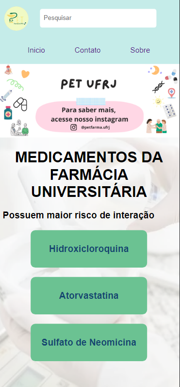

# Projeto PET-Farma

## 📄 Descrição do Projeto

Projeto desenvolvido com o objetivo de listar as medicações que possuem interação com os medicamentos da Farmácia Universitária da UFRJ.

## 📋 Tecnologias utilizadas
<ul>
<li>React.JS</li>
<li>Styled Components</li>
<ul>

  

Desenvolvido por Letícia Dayane

